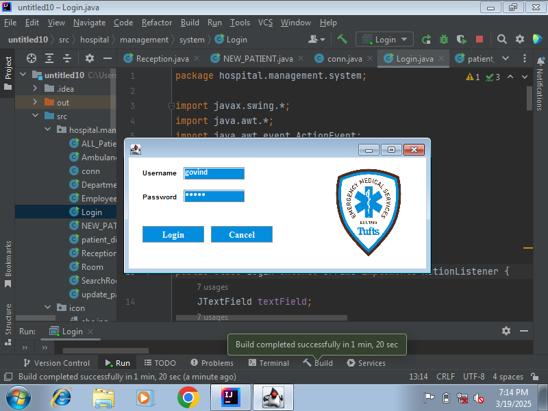
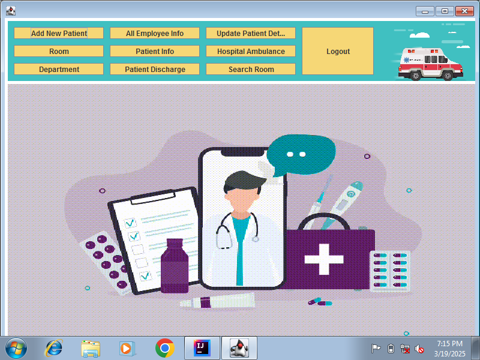
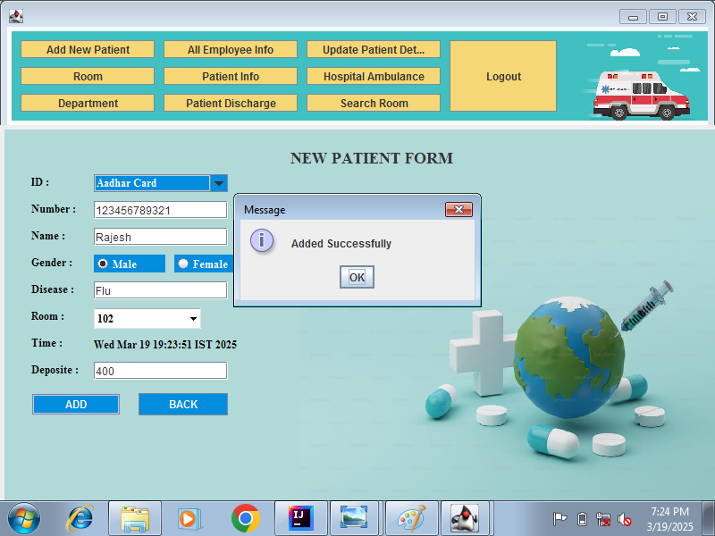
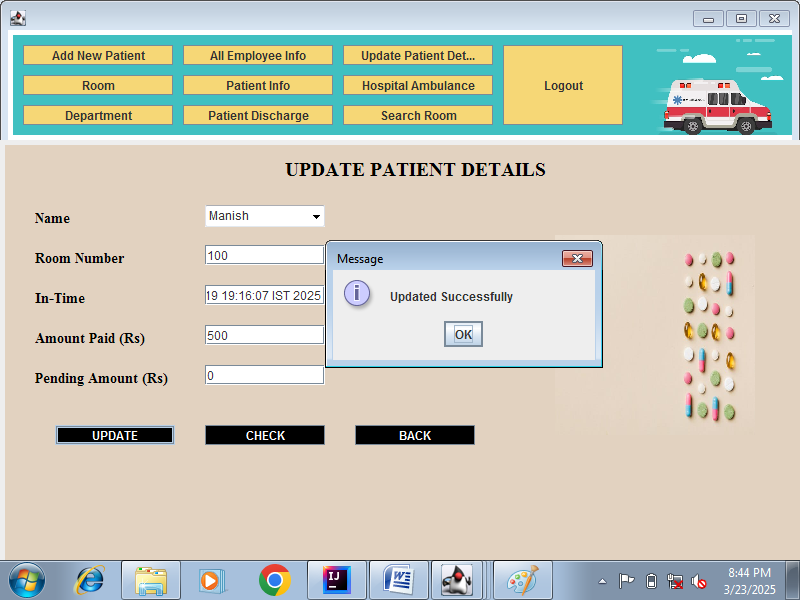
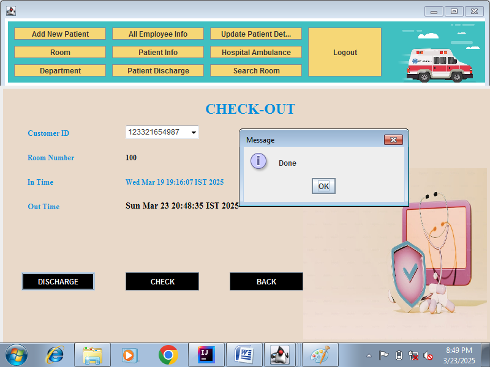
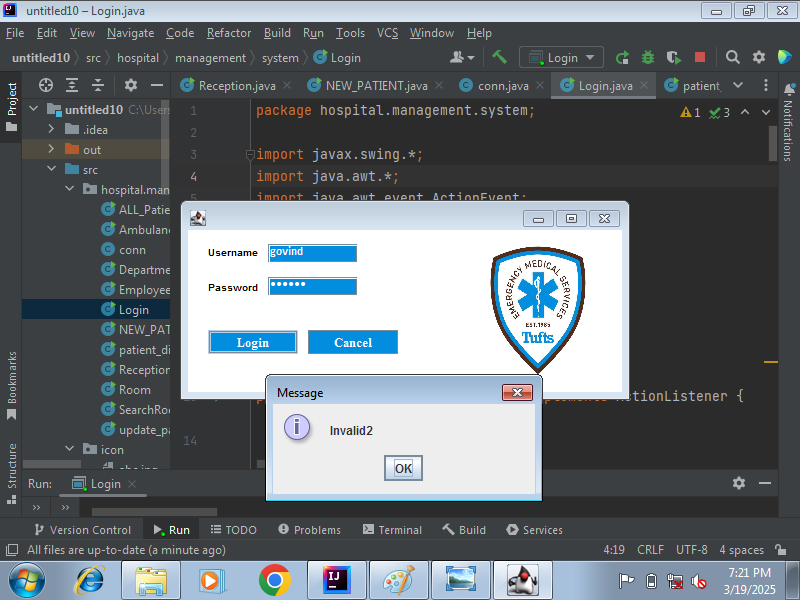

# Hospital Management System

A desktop Hospital Management System built with **Java Swing** (frontend) and **MySQL** (database via JDBC). Built as a final-year college project to digitize core front-desk hospital operations — patient registration, room/bed management, employee records, ambulance tracking, and billing.

## Screenshots

| Login | Dashboard |
|---|---|
|  |  |

| Add New Patient | Update Patient Details |
|---|---|
|  |  |

| Patient Checkout / Discharge | Invalid Login |
|---|---|
|  |  |

## Features

- **User Authentication** — Login screen with username/password validation against the database
- **New Patient Registration** — Capture ID proof (Aadhar/Voter ID/Driving License), name, gender, disease, room assignment, deposit amount, and timestamp
- **Patient Records** — View all admitted patients in a searchable table
- **Room Management** — Track room number, availability (occupied/available), price, and bed type
- **Search Room** — Filter rooms by availability status
- **Update Patient Details** — Edit room number, in-time, amount paid, and auto-calculate pending amount
- **Patient Discharge / Checkout** — Look up patient by ID, record out-time, and mark room as available again
- **Employee Info** — View staff records (name, age, phone, salary, email, Aadhar number)
- **Department Directory** — List hospital departments with contact numbers
- **Hospital Ambulance** — Track ambulance availability and location

## Tech Stack

- **Language:** Java
- **GUI:** Java Swing (AWT)
- **Database:** MySQL
- **Connectivity:** JDBC
- **Table rendering:** [proteanit `sql2table`](https://github.com/klaxit/sql2table) library (`net.proteanit.sql.DbUtils`) for binding `ResultSet` to `JTable`

## Project Structure

```
hospital-management-system/
├── src/hospital/management/system/
│   ├── Login.java                    # Login screen + authentication
│   ├── Reception.java                # Main dashboard with navigation
│   ├── NEW_PATIENT.java              # New patient registration form
│   ├── ALL_Patient_Info.java         # All patients table view
│   ├── update_patient_details.java   # Edit patient / billing details
│   ├── patient_discharge.java        # Discharge / checkout screen
│   ├── Room.java                     # Room listing
│   ├── SearchRoom.java               # Room search by availability
│   ├── Department.java               # Department directory
│   ├── Employee_info.java            # Employee records
│   ├── Ambulance.java                # Ambulance tracking
│   └── conn.java                     # Database connection helper
├── db.properties.example             # Template for DB credentials
├── .gitignore
└── README.md
```

## Setup & Run

### Prerequisites
- JDK 8 or later
- MySQL Server + MySQL Workbench
- MySQL Connector/J (JDBC driver) added to your project's classpath
- `sql2table` library (for `net.proteanit.sql.DbUtils`) added to your classpath
- An IDE such as IntelliJ IDEA or Eclipse (recommended)

### Steps

1. **Clone the repo**
   ```bash
   git clone https://github.com/<your-username>/hospital-management-system.git
   cd hospital-management-system
   ```

2. **Create the database**
   - Open MySQL Workbench and create a database named `hospital_management_system`
   - Create the required tables: `login`, `Patient_Info`, `room`, `department`, `EMP_INFO`, `Ambulance`
     (column names can be inferred from the SQL queries inside each `.java` file, e.g. `Room.java`, `NEW_PATIENT.java`)

3. **Configure database credentials**
   ```bash
   cp db.properties.example db.properties
   ```
   Edit `db.properties` and set your own MySQL username/password.

4. **Add required libraries to your classpath**
   - MySQL Connector/J
   - `sql2table` (proteanit) jar

5. **Run the app**
   - Open the project in your IDE, mark `src` as the sources root
   - Run `Login.java` (contains the `main` method) to launch the application

> **Note:** UI icons referenced in the code (e.g. `icon/login.png`, `icon/dr.png`) are loaded from an `icon/` resources folder that isn't included in this snapshot — add your own images at those paths, or remove the `ImageIcon` lines if you don't need them.

## Security Note

The original project had the MySQL password hardcoded in `conn.java`. This repo version reads credentials from a git-ignored `db.properties` file instead — copy `db.properties.example` to `db.properties` and fill in your own values before running.

## Author

Built as a final-year college project.
